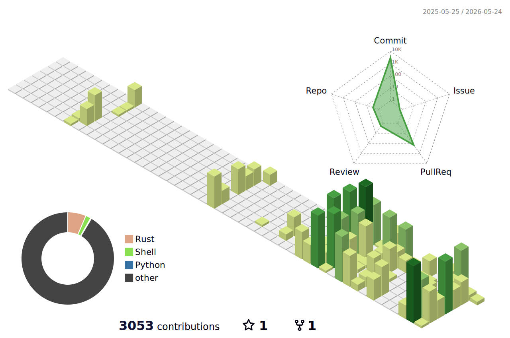

# J. Patrick Fulton

**CEO/Founder @ Fulton Engineering Services LLC**

 &nbsp; contact+blog@fultonengineeringservices.com

---

I came up as an individual contributor — architect, managing architect, engineering manager — designing frameworks and patterns for other teams, running professional development programs, and coaching engineers at every level. That foundation in systems thinking and IC craft is what I keep returning to, whether I'm writing production code, contributing to open source, or guiding teams through a platform overhaul.

Fulton Engineering Services is where that work lives outside of a company context: open source software, consulting engagements, and technical writing on practical system design, cloud architecture, and engineering leadership. In parallel, I'm CTO at Lockbox AI, building AI-first tooling for the post-acute care revenue cycle.

## What I'm Working On

- **[Fulton Engineering Services](https://www.fultonengineeringservices.com)** — consulting, open source, and writing. The blog covers practical system design, cloud architecture, and the realities of engineering leadership at growth-stage companies.
- **[Lockbox AI](https://github.com/jpfulton-lockboxai)** — AI-powered RCM platform for home health, hospice, and palliative care. I'm CTO there; it's the other half of my time.
- **Open Source** — upcoming contributions to SGLang, ONNX Runtime, and the AWS Redshift JDBC driver.

## Technical Focus

- Distributed systems architecture and cloud-first design on AWS
- AI-agent assisted engineering workflows — **harness engineering**
- Traditional ML, open weights model research, and inference infrastructure
- Systems-level OSS: query engines, ML runtimes, data connectors
- Engineering organization design: mentorship programs, architecture governance, IC leveling
- Healthcare technology: revenue cycle, patient engagement, cloud migrations from legacy platforms

## Writing

**[fultonengineeringservices.com](https://www.fultonengineeringservices.com)** — A Hugo-based blog on practical system design, cloud architecture, and engineering leadership. Written from the perspective of someone who has been an IC, an architect, and an executive — and still codes.

## Also Find Me At

**[github.com/jpfulton-lockboxai](https://github.com/jpfulton-lockboxai)** — work under the Lockbox AI organization, where I serve as CTO building AI-first revenue cycle management tooling for post-acute care providers.

---

